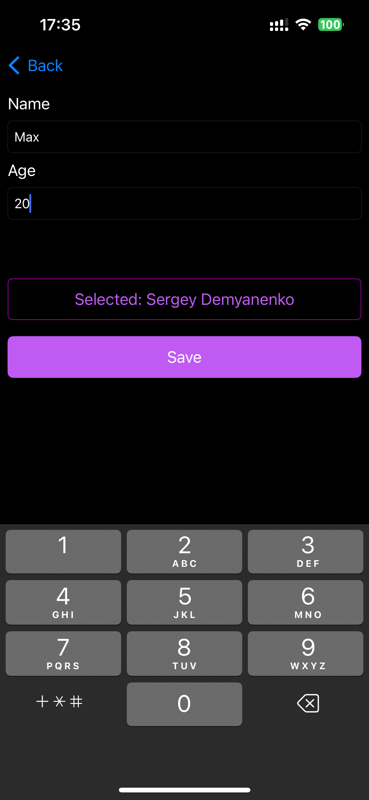

# Save information about students and teachers using Сore Data

## Getting Started

### Technologies Used
- **Xcode:** 15.0
- **iOS:** 15.0

### Installation
1. **Clone the repository**.
2. **Open the project in Xcode:**
   Open `.xcodeproj` or `.xcworkspace` file.

## Features
- Add new teacher
- Add new student with a teacher selection
- View information about a student and his teacher
- View information about a teacher and his students

## Screenshots

